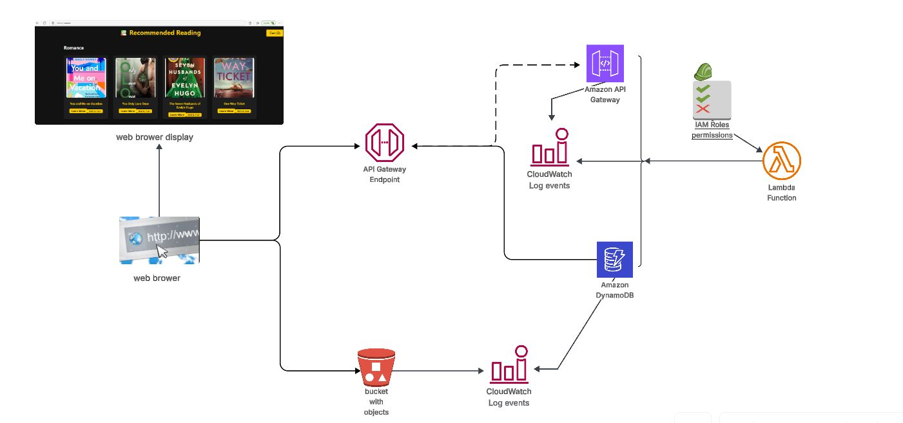

# Book Recommendation API - Serverless SaaS Application

This project is a fully serverless Book Recommendation API built on AWS using **Terraform**, **Lambda**, **API Gateway**, **DynamoDB**, and **S3**. It allows users to browse books by genre, view thumbnails, and get redirected to Amazon via a “Learn More” button. It also features a basic “Add to Cart” simulation.

---

## Features

- **Infrastructure-as-Code (IaC)** using Terraform for full AWS deployment
- **Serverless Backend** with AWS Lambda and API Gateway
- **API Endpoints** to fetch all books and personalized recommendations
- **DynamoDB Tables** for `Books` and `UserPreferences`
- **S3 Static Website** for serving the frontend and book thumbnails
- **CloudWatch Logs** for monitoring and debugging Lambda/API Gateway
- **IAM Roles & Permissions** for secure access control
- **Responsive Frontend** using HTML and Tailwind CSS

---

## Architecture

### Components:

- **API Gateway**: Handles HTTP requests and routes to Lambda
- **Lambda**: Serverless functions that process logic and access DynamoDB
- **DynamoDB**: NoSQL database storing book metadata and user preferences
- **S3**: Public bucket serving static site and book thumbnails
- **CloudWatch**: Logs Lambda and API activity for debugging

---

## IAM Policies Used

The following AWS-managed IAM policies were used in this project:

| Policy Name                           | Type         | Purpose                                       |
|--------------------------------------|--------------|-----------------------------------------------|
| `AmazonAPIGatewayInvokeFullAccess`     | AWS managed  | Invoke API Gateway endpoints                  |
| `AmazonAPIGatewayPushToCloudWatchLogs` | AWS managed  | Enable API Gateway logging to CloudWatch      |
| `AmazonDynamoDBFullAccess`             | AWS managed  | Full access to DynamoDB tables                |
| `AmazonS3ReadOnlyAccess`               | AWS managed  | Read access to book thumbnails in S3          |
| `CloudWatchLogsFullAccess`             | AWS managed  | Monitor Lambda/API Gateway logs               |
| `AWSLambdaBasicExecutionRole`          | AWS managed  | Required for Lambda logging to CloudWatch     |

---

## API Endpoints

- `GET /books`  
  Returns all available books

- `GET /books/preferences?genre=Fiction`  
  Returns books filtered by user preference (e.g., genre)

These endpoints are served through **Amazon API Gateway** and connected to **AWS Lambda** functions.

---

## DynamoDB Tables

- **Books**
  - Fields: `title`, `author`, `genre`, `amazonLink`, `thumbnail`
- **UserPreferences**
  - Fields: `userId`, `preferredGenre`

---

## Screenshots

| Screenshot | Description |
|------------|-------------|
|  | CloudWatch Logs for Lambda/API |
|  | Static Website hosted on S3 |
|  | Book and UserPreferences tables |
|  | Lambda functions to serve APIs |
|  | Lambda execution roles and permissions |
|  | Lambda functions to serve APIs |
|  | Book thumbnail images in S3 |
|  | API Gateway setup for endpoints |

---

## Deployment Notes

- **Terraform** used to provision:
  - Lambda functions and roles
  - API Gateway and routes
  - DynamoDB tables
  - S3 buckets for hosting and assets
  - IAM policies and roles
- Frontend hosted via **S3 Static Website**
- Public bucket used: `emma-book-thumbnails`

---

## Developed By
**Emma** 

---

## License

This project is licensed under the [MIT License](LICENSE).
